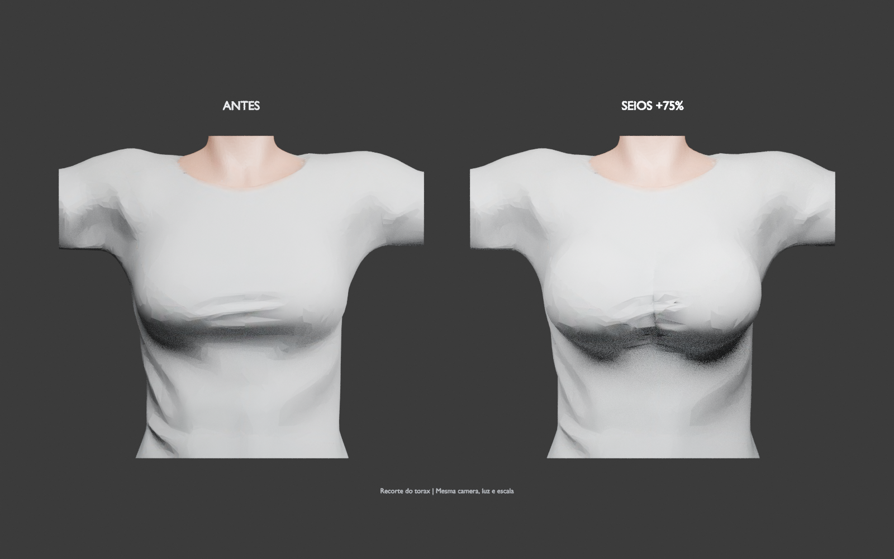
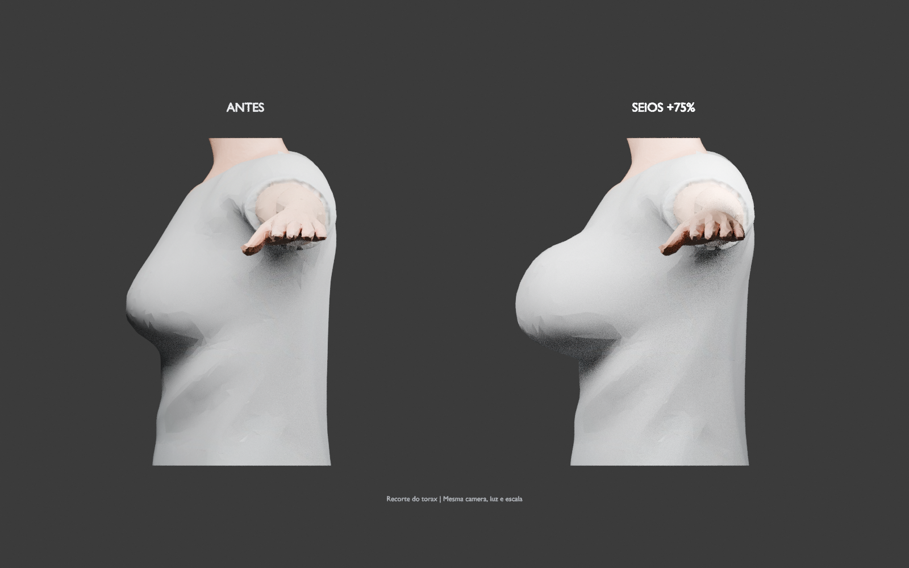
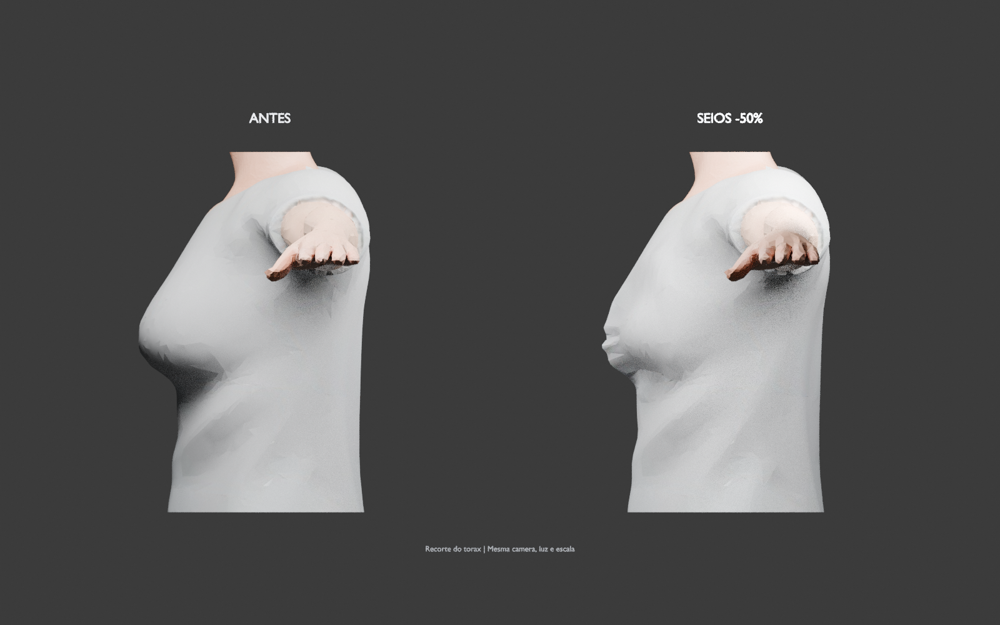

# Etapa 4 — volume dos seios por ossos ou marcadores

## Atualização — 29/09/2026

O campo por marcadores foi suavizado e validado no novo `models/femele.glb`.
Consulte a [validação dos seios em 360°](../femele-breast/README.md).
As medições abaixo registram a implementação anterior.

Validação em 28/09/2026 com o modelo feminino `femele-decimate-retextured-rename-parts.glb`.

## Como usar

1. Na **Corpo · Etapa 4**, selecione a preparação e clique em **Preparar controles**.
2. Em **Volume dos seios**, um par de ossos reconhecidos e com pesos válidos habilita o ajuste automaticamente.
3. Se não houver esse par, clique em **Marcar posição dos seios**. A visualização volta à base original. Marque o centro de cada seio na superfície, por cima da roupa se houver. Os lados esquerdo e direito são os do personagem.
4. Confira as duas esferas coloridas e ajuste **Área de influência**. Arraste para girar o modelo e use a roda para aproximar; arrastar não coloca um marcador.
5. Clique em **Usar marcadores** e ajuste o volume. Intensidades negativas reduzem, positivas aumentam; zero retorna ao original. A aplicação automática aguarda o término da marcação.
6. Compare com **Mostrar antes**, **Frente** e **Lado**. **Reposicionar marcadores** permite corrigir a região. Os presets salvos/exportados incluem as coordenadas e o raio.

As porcentagens indicam intensidade do controle, não uma medida de volume anatômico. O campo também deforma roupas na região marcada. Shape keys existentes continuam disponíveis como alternativa. **Restaurar** limpa os ajustes e marcadores; o arquivo de origem não é alterado.

## O que foi implementado

- Reconhecimento de pares como `Breast.L/R`, `LeftBreast/RightBreast`, `lBreast/rBreast`, `Bust.L/R` e prefixos `DEF-`, `ORG-` ou namespace. Nomes sem pesos ou o osso genérico `Chest` não bastam: nesse caso, o usuário define os marcadores.
- Shape keys reversíveis, sem novos ossos, sem alterar topologia ou sobrescrever o modelo original.
- Marcadores em coordenadas mundiais do GLB da base; conversão para o Blender, com rotação, translação e escala cobertas por teste. Shape keys já ativas na base são respeitadas ao localizar a superfície.
- Queda suave da deformação, com centro mais uniforme para evitar depressões na redução, até zero nas bordas e mistura limitada entre as duas regiões. Corpo e roupas recebem o mesmo campo espacial.
- Rejeição de marcadores ausentes, lados trocados, coordenadas não finitas, pontos fora do peito/modelo/superfície e raios inválidos. A marcação não aceita modificadores que alterem a quantidade de vértices da base avaliada.
- Comparação antes/depois com câmera preservada. A vista frontal solicitada para marcar é respeitada mesmo se o GLB ainda estiver carregando.

## Evidências no modelo feminino

O modelo usado não tem ossos específicos dos seios. Os dois pontos da validação foram obtidos por raycast do Three.js sobre a superfície da base. As posições do script são próprias desta fixture; o aplicativo solicita os cliques do usuário, sem adivinhar a anatomia.

| Caso | Vértices alterados (> 1e-6) | Deslocamento máximo |
| --- | ---: | ---: |
| Aumentar, intensidade +75% | 1.879 | 0,0217515 |
| Reduzir, intensidade −50% | 1.879 | 0,0145010 |
| Restaurar, intensidade 0 | 0 | 0,0000002843 |
| Seios +75%, altura +5%, tronco +15% | 161.386 | 0,0566512 |

Unidades do GLB; altura desta base ≈ 1. Nos ajustes isolados dos seios, **nenhum dos 159.504 vértices fora das duas áreas mudou acima da tolerância de 1e-5**. Os dois lados se moveram no sentido esperado. O caso combinado também altera outras regiões intencionalmente. Métricas completas, marcadores e relatórios: [measurements.json](measurements.json).

Imagens renderizadas no Blender a partir dos GLBs reais retornados pela API, com câmera, iluminação e escala iguais em cada par. São recortes do tórax feitos somente nas cópias usadas para renderização, para impedir sobreposição dos braços entre os painéis; os GLBs permanecem inteiros. Não são capturas da interface nem imagens geradas por IA.







## Testes e limites da validação

- **66 testes de backend aprovados**, incluindo Blender real: ossos com/sem pesos, ativação automática, área localizada, roupa, restauração, coordenadas transformadas, shape key preexistente, preservação da convexidade na redução, exportação/reimportação GLB, presets e dados inválidos.
- **Build TypeScript/Vite aprovado**. Permanecem os avisos já existentes de tamanho do bundle e depreciação do AnyIO nos testes.
- Fluxo HTTP/WebSocket real: preparação, aplicação, GLB, rejeição de três requisições inválidas e persistência dos marcadores nos presets.
- Geometria final verificada com o mesmo carregador, skinning e raycaster do Three.js utilizado pelo visualizador.
- Não havia navegador conectado para automatizar cliques na tela. A interação completa da interface ainda requer uma conferência manual; isso não é apresentado como teste de navegador aprovado.

SHA-256 do arquivo feminino original, conferido após os testes e preservado:

`fbb446f2b1b30275607e1b108acabcbb0a78f51b8b4ac4a77f294e1f0a38f2dd`

## Reproduzir

Com `./scripts/dev.sh` ativo e o modelo feminino já preparado:

```bash
PYTHONPATH=backend backend/.venv/bin/python -m pytest -q backend/tests
npm --prefix frontend run build
backend/.venv/bin/python scripts/validate_breast_api.py \
  --asset-id SEU_ASSET_ID \
  --output .local-data/stage4-breast
blender --background --factory-startup --disable-autoexec --python-exit-code 1 \
  --python scripts/render_body_comparison.py -- \
  --before .local-data/stage4-breast/before.glb \
  --after .local-data/stage4-breast/aumentar.glb \
  --focus-markers .local-data/stage4-breast/markers.json \
  --view side --label 'SEIOS +75%' --output .local-data/stage4-breast/lado.png
```
# Atualização — 29/09/2026

O campo por marcadores foi suavizado e validado no novo `models/femele.glb`.
Consulte a [validação dos seios em 360°](../femele-breast/README.md).
As medições abaixo registram a implementação anterior.
